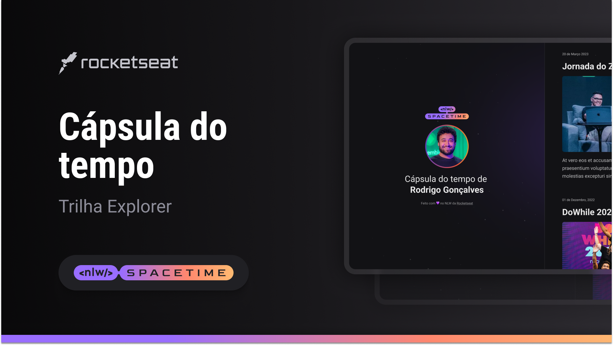

   
  

## 💻 Projeto
Esse é um projeto web responsivo de uma capsula do tempo para exibir memorias em uma linha do tempo.

## 🚀 Tecnologias
Esse projeto foi desenvolvido durante o NLW da Rocketseat com as seguintes tecnologias:

-HTML
-CSS
-Git e Github

## 󠀠󠀠🏷️ Layout
Você pode visualizar o layout do projeto atraves [desse link] (https://www.figma.com/file/RXdGTHiQsNOK6W4oldiqZa/C%C3%A1psula-do-tempo-%E2%80%A2-Trilha-Explorer-(Community)?type=design&node-id=306%3A84&t=TIBRk5XeKGzDqs6y-1).
É necessário ter uma conta no [figma](https://www.figma.com)
